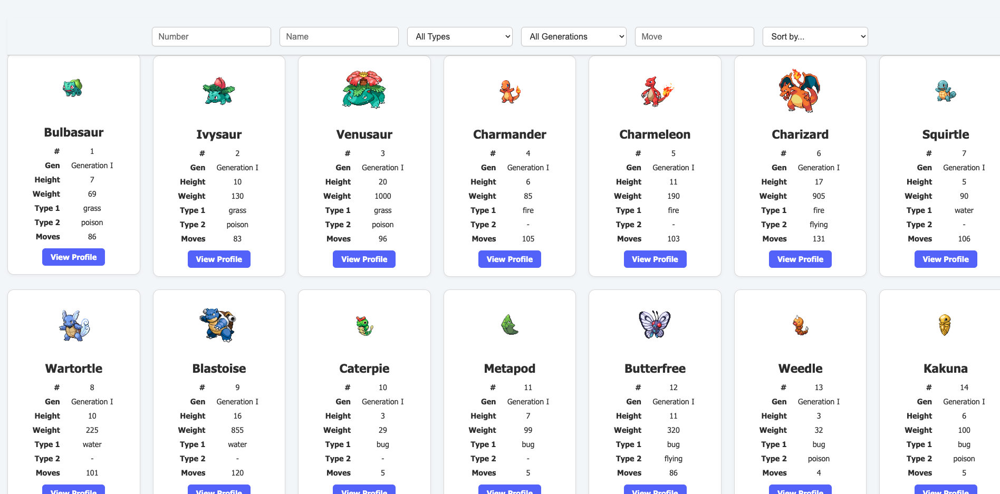
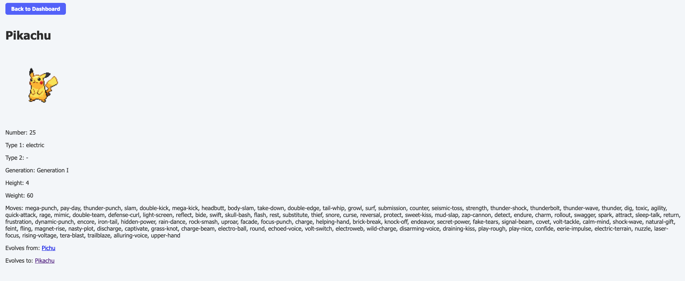

# Pokémon Dashboard

## Table of Contents
- [Description](#-description)  
- [Installation](#️-installation)  
- [Usage](#-usage)  
- [Technologies Used](#️-technologies-used)

---

## Description

Oh no! Pokemons have magically come to life and are running rampant across the globe! Curious to see which one you've caught, look no further! This application, created for the Kalderos Surface Engineeering take-home provides you all the information you could hope for, right at your fingertips. Filter by height, weight, name, type, etc. 
---

## Installation

### 1. Clone the repository
```bash
git clone https://github.com/cindyf636/pokemon-app.git
cd pokemon-app
```

### 2. Install and run the backend (ASP.NET Core)
```bash
cd server
dotnet run
```

> The backend API will be served at: `http://localhost:5210`

### 3. Install and run the frontend (React)
```bash
cd client
npm install
npm run dev
```

> The frontend will run at: `http://localhost:5173` (or whichever port Vite chooses)

---

## Usage

Once both servers are running:

- Visit the React frontend in your browser (usually `http://localhost:5173`)
- Use the **dashboard page** to:
  - View a summary of total Pokémon species
  - Filter Pokémon by number, name, type, generation, or move
  - Browse Pokémon cards (25 per page)
  - Click a Pokémon to view detailed information

- On the **details page**, you can:
  - See stats, moves, evolution info, and image
  - Navigate to previous or next evolutions via clickable links
  - Return to the dashboard with a single button


---

## Technologies Used

**Frontend:**
- React
- React Router
- Axios
- Vite (or CRA)
- CSS (custom styling)

**Backend:**
- ASP.NET Core Web API
- C#
- System.Text.Json

**Data:**
- Static JSON file (`pokemon.json`) from the PokeAPI dataset